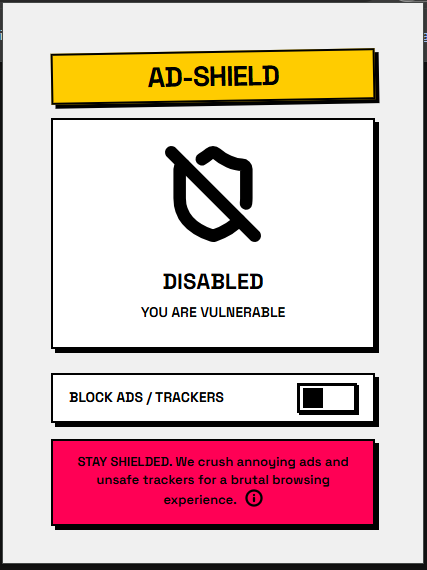
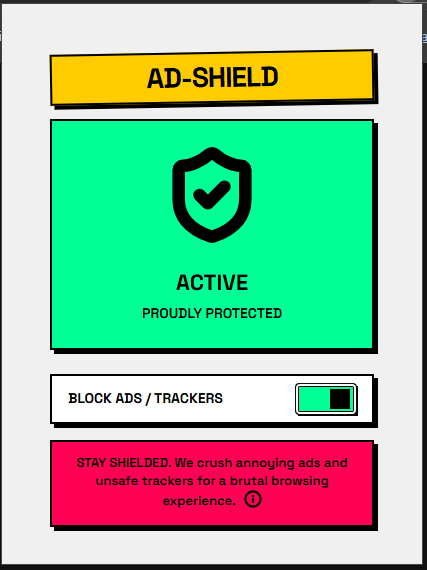

# AdShield

**Lightweight ad blocker that blocks intrusive ads, popups and malicious redirects for a smoother browsing experience**

> Transform your web browsing into a clean, safe, and distraction free experience

<!-- [Download Ad-Shield from Chrome Web Store](#) -->


## Why Built This?

Web browsing (especially when downloading media) has become increasingly frustrated by intrusive ads, popups, and redirect attacks that compromise both user experience and security. After experiencing countless interruptions and seeing how existing solutions were either resource-heavy or missed critical threats, I decided to build a lightweight yet powerful alternative.

AdShield was born from a desire to build a robust solution from the ground up that:

- Blocks ads without impacting browser performance
- Protects against malicious redirects and pop-ups
- Maintains legitimate website functionality
- Provides users with control and transparency

The goal was to create a safe browsing environment while mastering modern browser APIs in a real-world scenario.

## Built With

- **WXT Framework** - Modern web extension framework
- **React** - User interface components
- **TypeScript** - Type safe development
- **Tailwind CSS** - Styling framework
- **Lucide React** - Icon library


### Screens

- **Inactive blocker**
  

- **Active blocker**
  


### What Gets Blocked

- **Display Ads**
- **Popup Ads**:
- **Redirect Attacks**
- **Tracking Scripts**
- **Malicious Iframes**

## Development

Want to contribute or run Ad-Shield locally?

```bash
# Clone the repository
git clone https://github.com/sgundavid-dev/ad-shield

# Navigate to project directory
cd AdShield

# Install dependencies
pnpm install

# Start development server
pnpm run dev
```

### Project Structure

```
.
├── adblock-active.PNG
├── adblock-inactive.PNG
├── assets/
├── components/
├── components.json
├── context/
├── core-components.md
├── entrypoints/
│   ├── background.ts
│   ├── content.ts
│   └── popup/
├── hooks/
├── lib/
├── package.json
├── pnpm-lock.yaml
├── public/
├── README.md
├── tsconfig.json
├── types.ts
└── wxt.config.ts
```

## Contributing

Contributions are welcome! Here's how you can help:

1. **Report Issues**: Found a bug or have a feature request? Open an issue
2. **Submit PRs**: Fork the repo, create a branch, and submit a pull request
3. **Test & Feedback**: Try the extension and share your experience

Thanks for reading! :)
